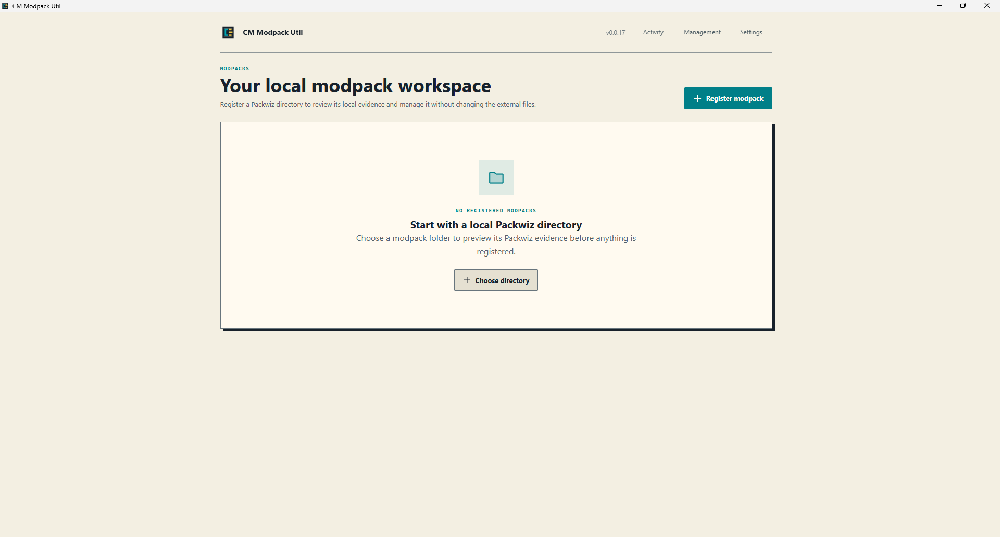

# CM Modpack Util

CM Modpack Util is a local-first Windows desktop workspace for CM modpacks,
built with **Tauri 2**, **SvelteKit**, **TypeScript**, **Vite**, and **SQLite**.



## Current capabilities

- Register, validate, reconnect, archive, and manage local Packwiz modpacks
  without rewriting their project files.
- Inspect current mod inventory, provider identity, side, pin state, validation
  evidence, project facts, and activity.
- Check for updates through the tested Packwiz compatibility profile and review
  immutable discovery snapshots with durable decisions and notes.
- Apply explicitly selected targeted Packwiz updates and verified pin/unpin
  operations, with cancellation, freshness checks, post-operation verification,
  and partial-outcome reporting.
- Create release workspaces from captured evidence and compare historical
  releases without silently rereading the current working tree.
- Generate, review, revise, and export Markdown changelogs using bounded
  Modrinth access and exact offline cache reuse where available.
- Manage application-owned records, cleanup eligible cache/export observations,
  and transfer application data through versioned recovery bundles.
- Check stable GitHub release metadata automatically at startup and from
  Settings. Downloading, installing, and restarting remain user-controlled.

## Important boundaries

- Packwiz project files remain authoritative for external modpack state.
- `packwiz update -a` is used for safe discovery and cancellation probing;
  selected updates use verified targeted Packwiz commands.
- Rust owns filesystem access, Packwiz processes, SQLite, network access, URL
  trust, process execution, path authorization, and safety classification.
- GitHub enrichment, CurseForge API access, cloud synchronization,
  collaboration, unattended updates, and non-Markdown export remain outside
  the initial release boundary.
- The alpha database has no migration workflow. Existing incompatible local
  databases require the documented [stop-app/reset procedure](docs/data-management.md#database-behavior).
- Windows installers may show SmartScreen or unknown-publisher warnings because
  Microsoft Authenticode signing is not part of the initial release. Tauri
  updater signatures still verify downloaded updater artifacts.

## Download and install

The initial release targets Windows x64 and is distributed as an NSIS
installer. Download the latest published release from
[GitHub Releases](https://github.com/ChefMooon/cm-modpack-util/releases/latest),
run the setup executable, and follow the installer prompts. The app checks for
stable updates at startup and in Settings; downloading and installing an update
remain user-controlled.

Packwiz-powered discovery, updates, pinning, and unpinning require the tested
Packwiz 1.1.0 Windows x64 executable (`packwiz.exe`) to be available on `PATH`.
Registration and local inventory inspection do not require running Packwiz.
See the [supported Packwiz profile](docs/packwiz-commands.md) for compatibility
details.

## First use

1. Register a local Packwiz modpack folder and review its project details.
2. Inspect its inventory and refresh local evidence when needed.
3. Discover available updates, review candidates, and apply only the selected
   updates.
4. Create a release workspace, review the captured changes, and generate and
   export a Markdown changelog when ready.

See the guides for [registration](docs/modpack-registration.md),
[Packwiz update review](docs/packwiz-commands.md),
[release workspaces](docs/release-workspace-validation.md), and
[changelog generation and export](docs/changelog-generation.md).

## Data and network use

Application-owned settings, modpack records, observations, and history are
stored locally in SQLite. Packwiz project files remain the source of truth for
external modpack state. The app checks GitHub release metadata at startup and
from Settings. Explicit changelog generation may request Modrinth data, though
exact cached responses can be reused offline. Packwiz update discovery and
selected mod updates may need network access; pin and unpin operations change
local Packwiz metadata. The app does not provide cloud synchronization. See
[data management](docs/data-management.md) for storage, transfer, and reset
details.

## Development setup

### Prerequisites

- [Node.js](https://nodejs.org/) 20 or newer
- [Rust](https://www.rust-lang.org/tools/install) and Cargo
- Platform dependencies for [Tauri](https://v2.tauri.app/start/prerequisites/)

### Run the desktop app

```bash
npm install
npm run tauri dev
```

The Vite-only frontend can also be run with `npm run dev`.

## Development commands

| Command | Description |
| --- | --- |
| `npm run tauri dev` | Start the desktop app in development mode |
| `npm run tauri build` | Create a production desktop bundle |
| `npm run dev` | Start the SvelteKit development server |
| `npm run build` | Build the static frontend |
| `npm run check` | Run Svelte and TypeScript checks |
| `npm test` | Run focused frontend contract checks |
| `cargo fmt --manifest-path src-tauri/Cargo.toml -- --check` | Check Rust formatting |
| `cargo test --manifest-path src-tauri/Cargo.toml` | Run Rust tests |

## Documentation

- [`0.1.0` release-readiness roadmap](docs/ROADMAP.md)
- [Historical milestone roadmap](docs/archive/ROADMAP-v0.0.1-v0.0.9.md)
- [Product specification](docs/CM-MODPACK-UTIL-SPEC.md)
- [Packwiz compatibility and command safety](docs/packwiz-commands.md)
- [Modpack registration](docs/modpack-registration.md)
- [Changelog generation and export](docs/changelog-generation.md)
- [Data management, transfer, cleanup, and database behavior](docs/data-management.md)
- [Settings](docs/settings.md)
- [Release workspace validation](docs/release-workspace-validation.md)
- [Windows updater and release procedure](docs/desktop-updates.md)
- [Changelog](CHANGELOG.md)

## Project structure

- `src/routes/` — route-level Svelte UI for modpacks, activity, management, and settings
- `src/components/` — reusable UI and feature components
- `src/lib/` — typed frontend contracts, invocation wrappers, settings, and updater state
- `src-tauri/src/` — Rust commands, domain contracts, persistence, discovery, safety, and process boundaries
- `src-tauri/src/db/schema.sql` — canonical alpha database schema
- `src-tauri/tauri.conf.json` — application version, Windows bundle, and updater configuration
- `docs/` — product contracts, compatibility rules, release procedures, validation, and plans

## Recommended VS Code extensions

- [Svelte for VS Code](https://marketplace.visualstudio.com/items?itemName=svelte.svelte-vscode)
- [Tauri](https://marketplace.visualstudio.com/items?itemName=tauri-apps.tauri-vscode)
- [rust-analyzer](https://marketplace.visualstudio.com/items?itemName=rust-lang.rust-analyzer)

## License

This project is licensed under the [MIT License](LICENSE).
